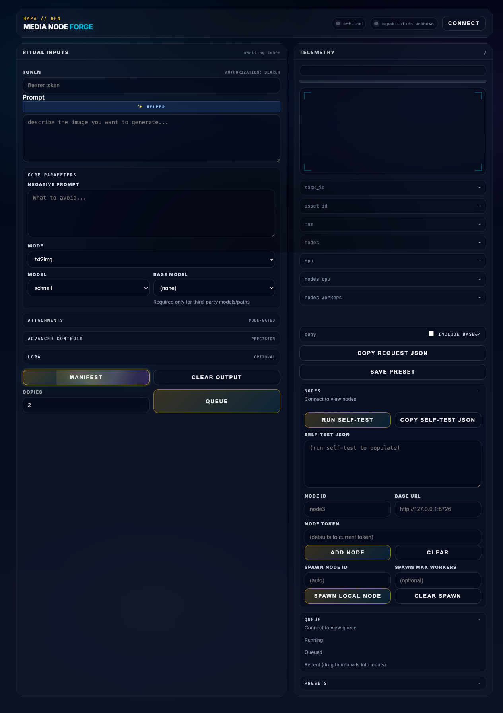

# Hapa MLX Station

Hapa MLX Station is the Apple Silicon media-generation station for the Hapa.ai node ecosystem. In this repository the verified implementation surfaces are:

- `hapa_media_node`: a FastAPI media node for local image generation through MLX/mflux, with a queue, SQLite task/asset store, artifact downloads, presets, a browser UI, and a hub/router mode for multi-node routing.
- `hapa_keys_node`: a loopback-first key vault/proxy service for local Gemini/OpenAI calls and secret storage.
- `reference/`: Hapa-specific design notes, API contract notes, mflux source notes, and multi-machine setup guidance.
- `scripts/` and `tests/`: local smoke/unit checks for the hub, node, and port-allocation behavior.

Verified in this docs sweep: source files, CLI parser, API route declarations, reference docs, Overwatch node runbooks, and cheap Python checks. Runtime image-generation health is not claimed here unless you run the node/hub smoke tests against a configured MLX/mflux environment and model access.

## Hapa ecosystem role

Hapa MLX Station is a local compute and embodiment node: it turns Hapa prompts, lore, avatar/worldbuilding requests, and other agent outputs into local media artifacts on Apple Silicon. It is also a proving ground for local-first node patterns used elsewhere in Hapa: bearer-token auth, health/capabilities endpoints, SQLite-backed truth, artifact storage, hub routing, and self-test protocols.

Related wiki/runbook anchors:

- Global wiki node note: `Hapa_Worldbuilding_Wiki/Nodes/Existing/hapa-mlx-station.md`
- Overwatch media node runbook: `.Overwatch/nodes/MAC_HAPA_MEDIA_NODE.md`
- Overwatch media hub runbook: `.Overwatch/nodes/MAC_HAPA_MEDIA_HUB.md`
- API contract: `reference/05_api_contract_v1.md`
- Multi-machine setup: `reference/06_multi_machine_setup.md`
- Publication boundary: `docs/PUBLICATION_BOUNDARY.md`

## Requirements

- macOS on Apple Silicon for real MLX/mflux generation.
- Python 3.10+ is recommended by the project docs. Some system Python installs may lack runtime dependencies until `requirements.txt` is installed.
- `fastapi`, `uvicorn[standard]`, and `httpx` from `requirements.txt`.
- `mflux` on Darwin for real image generation.
- Hugging Face/model access where required by the selected mflux model.

## Install

```bash
cd hapa-mlx-station
python3 -m venv .venv
source .venv/bin/activate
pip install -r requirements.txt
# Optional/when using gated models:
hf auth login
```

## Main commands

Media node and hub:

```bash
# Run one media node, loopback by default.
python -m hapa_media_node serve --port 8723

# Run the hub/router against configured nodes.
python -m hapa_media_node hub --port 8726 --nodes-file ./nodes.json

# Run a local stack for development.
python -m hapa_media_node stack --hub-port 8723 --node-base-port 8724 --num-nodes 1

# Query a running service.
python -m hapa_media_node capabilities --base-url http://127.0.0.1:8723 --token "$HAPA_MEDIA_NODE_TOKEN"

# Submit a generation request to a running node or hub.
python -m hapa_media_node generate \
  --base-url http://127.0.0.1:8723 \
  --token "$HAPA_MEDIA_NODE_TOKEN" \
  --prompt "cosmic starship in nebula" \
  --model schnell \
  --steps 4 \
  --output out.png

# Hub/node self-test against a configured running service or spawned local nodes.
python -m hapa_media_node self-test --token "$HAPA_MEDIA_HUB_TOKEN"
```

Keys node:

```bash
# Run local keys/proxy service, default port 8733.
python -m hapa_keys_node serve

# Query health/capabilities.
python -m hapa_keys_node health --base-url http://127.0.0.1:8733
python -m hapa_keys_node capabilities --base-url http://127.0.0.1:8733 --token "$HAPA_KEYS_NODE_TOKEN"

# Manage stored secrets.
python -m hapa_keys_node secrets list --base-url http://127.0.0.1:8733 --token "$HAPA_KEYS_NODE_TOKEN"
python -m hapa_keys_node secrets set gemini_api_key --stdin --base-url http://127.0.0.1:8733 --token "$HAPA_KEYS_NODE_TOKEN"
```

## Ports, auth, and storage

Default ports:

- Media node: `127.0.0.1:8723` via `HAPA_MEDIA_NODE_HOST` / `HAPA_MEDIA_NODE_PORT`.
- Media hub: `127.0.0.1:8723` by default via `HAPA_MEDIA_HUB_HOST` / `HAPA_MEDIA_HUB_PORT`; use `8726` when running beside a local node to avoid conflicts.
- Local stack: hub defaults to `8723`, spawned nodes default to base port `8724`.
- Keys node: `127.0.0.1:8733` via `HAPA_KEYS_NODE_HOST` / `HAPA_KEYS_NODE_PORT`.

Auth:

- `/health` is public.
- `/`, the browser UI, is public where present.
- `/capabilities` and `/v1/*` endpoints require bearer auth.
- Tokens can be set with `HAPA_MEDIA_NODE_TOKEN`, `HAPA_MEDIA_HUB_TOKEN`, or `HAPA_KEYS_NODE_TOKEN`; otherwise the services generate local token files such as `.node_token`.
- Query-token auth is disabled by default. Enable only intentionally with `HAPA_MEDIA_ALLOW_QUERY_TOKEN=1`, `HAPA_MEDIA_NODE_ALLOW_QUERY_TOKEN=1`, `HAPA_MEDIA_HUB_ALLOW_QUERY_TOKEN=1`, or `HAPA_KEYS_NODE_ALLOW_QUERY_TOKEN=1`.
- Admin APIs can be disabled with the relevant `*_DISABLE_ADMIN_API` environment variables.

Storage and data products:

- Media node defaults to `./data/`, with SQLite at `data/hapa_media_node.sqlite3` and media artifacts under `data/artifacts/` unless overridden by `HAPA_MEDIA_NODE_STORAGE_DIR`, `HAPA_MEDIA_NODE_DB_PATH`, or `HAPA_MEDIA_NODE_ARTIFACTS_DIR`.
- Keys node defaults to a private secrets file under its configured storage directory; see `hapa_keys_node/config.py` for exact env overrides.
- Runtime data, token files, databases, and generated artifacts are local operational state and are gitignored.

## API surface

Media node public endpoints:

- `GET /`
- `GET /health`

Media node authenticated endpoints include:

- `GET /capabilities`
- `GET /v1/system`
- `POST /v1/images/generations`
- `GET /v1/tasks/{task_id}` and `GET /v1/tasks`
- `GET /v1/queue`
- `POST /v1/presets`, `GET /v1/presets`, `GET /v1/presets/{preset_id}`, `DELETE /v1/presets/{preset_id}`
- `GET /v1/assets/{asset_id}` and `GET /v1/assets/{asset_id}/download`
- Admin: `POST /v1/admin/workers`

Media hub exposes the same client-facing generation/task/asset/preset shape, using composite IDs such as `node_id:uuid`, plus admin endpoints for node registration, enable/disable, spawning, worker scaling, local process listing/termination, and self-tests. See `hapa_media_node/hub_app.py` and `reference/05_api_contract_v1.md`.

Keys node public/authenticated endpoints include:

- `GET /`, `GET /health`
- `GET /capabilities`
- Admin secrets: `GET /v1/admin/secrets`, `GET|PUT|DELETE /v1/admin/secrets/{name}`
- Proxy calls: `POST /v1/gemini/generateContent`, `POST /v1/openai/chat/completions`

## Data inputs and outputs

Inputs:

- Text prompts and optional negative prompts.
- Optional base64 or asset-backed input images for image-to-image, fill, depth, ControlNet, Redux, and upscale workflows.
- Optional model selection, base model path/name, LoRA paths/scales/style, guidance, quantization, seed, dimensions, and low-RAM flags.
- Optional stored API keys/secrets for the keys node proxy surface.

Outputs:

- Task records with status, stage, progress, errors, and result metadata.
- Image artifacts stored on disk and exposed by asset metadata/download endpoints.
- Presets and queue state stored in SQLite.
- Self-test and benchmark JSON output when requested by CLI flags.

## Verification commands

Cheap checks used for this docs/licensing sweep:

```bash
python3 -m compileall -q hapa_media_node hapa_keys_node tests test_connection.py test_new_features.py test_preview.py verify_preview_features.py scripts/multi_node_hub_smoke_test.py
python3 -m unittest discover -s tests
python3 -m hapa_media_node --help
```

Additional runtime checks when dependencies, model access, and tokens are configured:

```bash
python -m hapa_media_node self-test --token "$HAPA_MEDIA_HUB_TOKEN"
python scripts/multi_node_hub_smoke_test.py --hub-token "$HAPA_MEDIA_HUB_TOKEN"
python -m hapa_keys_node self-test --token "$HAPA_KEYS_NODE_TOKEN"
```

## Licensing and Bananas attribution

Project-level license: MIT under Hapa.ai / Calder Wong. See `LICENSE`.

Third-party dependencies, model weights, generated assets, and any vendored or referenced upstream materials remain under their own license terms. Do not remove third-party notices.

Contributors may optionally opt into Bananas work-contribution tracking for attribution. Bananas attribution is a contribution/accounting layer; it does not replace the MIT license grant for project code unless a separate written agreement says otherwise.

## Current risks / open questions

- Real generation depends on the local Apple Silicon environment, mflux installation, model availability, and Hugging Face/model permissions.
- Several root-level ad hoc test scripts reference local bearer-token values and should be reviewed before publishing or broad sharing.
- The repo currently includes active code changes beyond this docs sweep; this README documents verified surfaces but does not assert all uncommitted runtime changes are production-ready.

<!-- HAPA-README-SCREENSHOT-2026-05-22 -->

## Screenshot



Hapa MLX Station / Media Node Forge UI in offline static smoke mode.


<!-- HAPA-README-QUALITY-PASS-2026-05-22 -->

## Hapa ecosystem context


### Shared ecosystem pattern

Hapa is built as a constellation of modular nodes. Each node owns a focused capability, but participates in a shared protocol for provenance, handoff, cards, memory, and operations.

Every node is designed for both human operators and AI agents. The target contract is three surfaces: a UI for direct human review/control, an API for node-to-node and agent calls, and a CLI for scripted runs, audits, and handoffs. Individual repos may be at different maturity levels, but the public contract is that humans and agents can inspect, operate, and verify the node.

Hapa nodes power AI agents and avatar-agents that build new nodes and enhance existing ones. As work moves through the ecosystem, it is mined for utility, wisdom, and repeatable logic, then distilled into Hapa Cards: portable packets of skills, context, memories, and operational patterns.

Humans and AIs use Hapa Cards to discuss, ideate, prototype, and deploy increasingly complex workflows through a playable, card-collecting mechanic. Collaboration history, skills, work artifacts, and canonical decisions are stored in [hapa-second-brain](https://github.com/calderwong/hapa-second-brain), enriched into [Hapa Worldbuilding Wiki](https://github.com/calderwong/hapa-worldbuilding-wiki) entries, and converted back into cards. Avatar-agents can also be combined or specialized into purpose-built identities with their own storage, lore, canon, card decks, skills, and protocols.

### Purpose

Apple Silicon media-generation station and hub that exposes local image/media generation and node orchestration through authenticated HTTP/UI surfaces.

### Current status

- Status: **active media node**.
- Expected source root in `hapa-system`: `hapa-mlx-station/`.
- This README is intended to be useful to both human operators and future agents: it should explain what the node is for, what it consumes, what it emits, how it connects to other Hapa nodes, and what should stay out of git.

### Inputs

- Text prompts, generation parameters, node tokens, presets, and optional source images
- Model/runtime assets kept outside git

### Outputs

- Generated media artifacts, task manifests, telemetry, and node/hub responses
- Media previews for Cards, wiki pages, and production runs

### Interfaces

- FastAPI media node and hub APIs
- Browser Media Node Forge UI
- CLI/self-test scripts

### Related Hapa nodes

- [hapa-dev-proto](https://github.com/calderwong/hapa-dev-proto-private) — Primary local-first app; many nodes feed it cards, assets, chat, debug, or projection data.
- [Hapa_Worldbuilding_Wiki](https://github.com/calderwong/hapa-worldbuilding-wiki) — Canonical Markdown graph for lore, nodes, names, cards, systems, and provenance.
- [.Overwatch](https://github.com/calderwong/overwatch) — Operations map: inventory, source index, task inbox, protocols, and runbooks.
- [hapa-telemetry-node](https://github.com/calderwong/hapa-telemetry-node) — Discovery/monitoring hub for node health, capabilities, launchers, and relationships.
- [hapa-keys-node](https://github.com/calderwong/hapa-keys-node) — Local key vault used by authenticated nodes and tools.
- [hapa-lore-node](https://github.com/calderwong/hapa-lore-node) — Chronicle/canon service for daily progress, lore, and searchable wisdom.
- [hapa-anvil-node](https://github.com/calderwong/hapa-anvil-node) — Card standardization/evaluation/forge node for turning raw card ideas into usable artifacts.
- [hapa-janus-world-node](https://github.com/calderwong/hapa-janus-world-node) — World-state truth kernel and event tape for Janus/desktop simulation work.
- [hapa-lance-node](https://github.com/calderwong/hapa-lance-node) — Local indexing/projection layer for cards, wiki chunks, embeddings, and multimodal records.

### Operating contract

- Treat generated media, local databases, model weights, dependency folders, build outputs, app bundles, and secrets as runtime artifacts unless this README explicitly says otherwise.
- Prefer loopback/local operation first; expose network services only with explicit auth and operator intent.
- When this node produces artifacts for another node, record enough provenance for the receiving node or wiki page to recover the source path, command, prompt, or API request.
- Keep `README.md`, `LICENSE`, `NOTICE.md` where applicable, and repo-local screenshots current as the node evolves.
